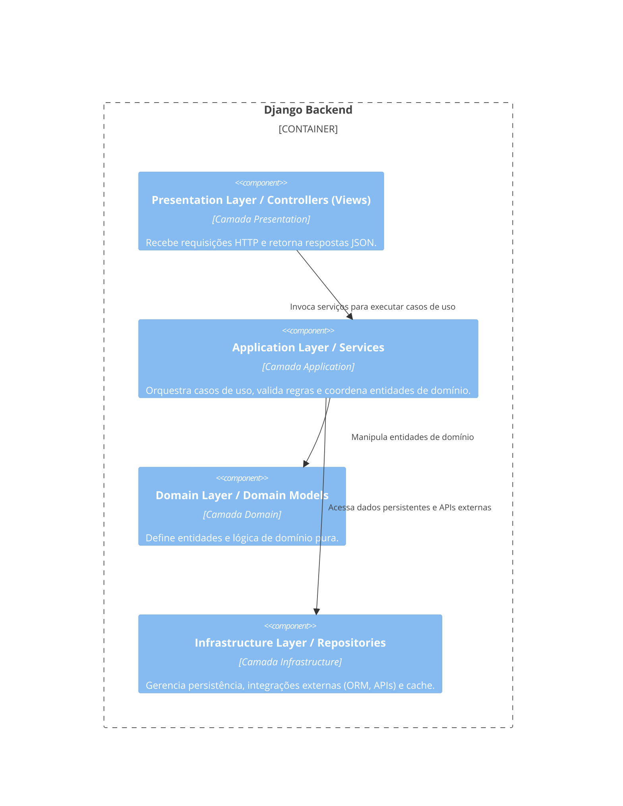
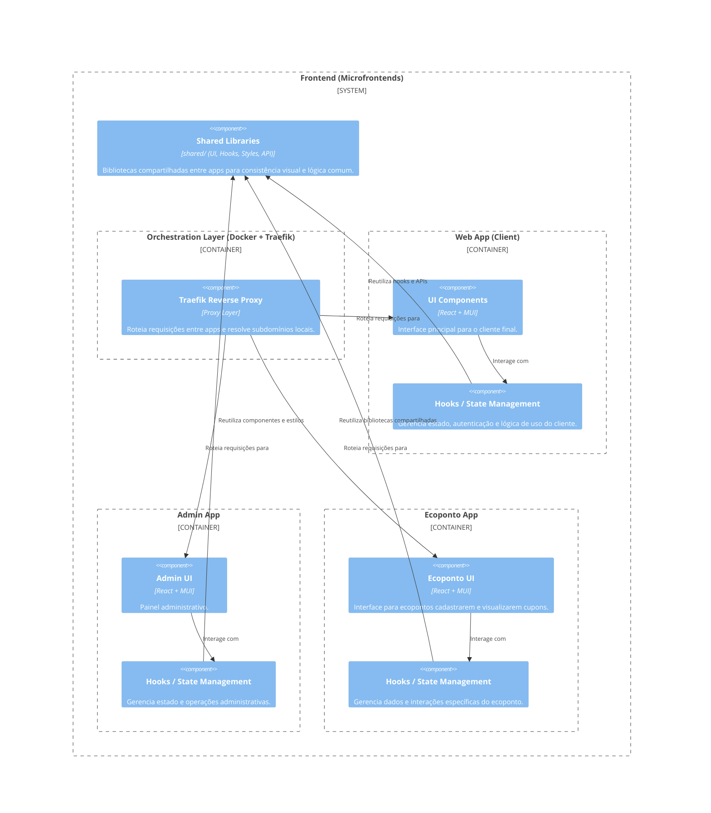

# Recicash - Component Diagrams

## Backend Component Diagram

```mermaid
C4Component

    Container_Boundary(backend, "Django Backend") {
        Component(presentation, "Presentation Layer / Controllers (Views)", "Camada Presentation", "Recebe requisições HTTP e retorna respostas JSON.")
        Component(application, "Application Layer / Services", "Camada Application", "Orquestra casos de uso, valida regras e coordena entidades de domínio.")
        Component(domain, "Domain Layer / Domain Models", "Camada Domain", "Define entidades e lógica de domínio pura.")
        Component(infrastructure, "Infrastructure Layer / Repositories", "Camada Infrastructure", "Gerencia persistência, integrações externas (ORM, APIs) e cache.")
    }

    Rel(presentation, application, "Invoca serviços para executar casos de uso")
    Rel(application, domain, "Manipula entidades de domínio")
    Rel(application, infrastructure, "Acessa dados persistentes e APIs externas")
    
    UpdateRelStyle(presentation, application, $offsetX="-50", $offsetY="30")
    UpdateRelStyle(application, domain, $offsetX="50", $offsetY="5")
    UpdateRelStyle(application, infrastructure, $offsetX="10")
```

## Frontend Component Diagram

```mermaid
C4Component

    System_Boundary(frontend, "Frontend (Microfrontends)") {

        Container_Boundary(proxy, "Orchestration Layer (Docker + Traefik)") {
            Component(traefik, "Traefik Reverse Proxy", "Proxy Layer", "Roteia requisições entre apps e resolve subdomínios locais.")
        }

        Container_Boundary(web, "Web App (Client)") {
            Component(web_ui, "UI Components", "React + MUI", "Interface principal para o cliente final.")
            Component(web_logic, "Hooks / State Management", "", "Gerencia estado, autenticação e lógica de uso do cliente.")
        }

        Container_Boundary(admin, "Admin App") {
            Component(admin_ui, "Admin UI", "React + MUI", "Painel administrativo.")
            Component(admin_logic, "Hooks / State Management", "", "Gerencia estado e operações administrativas.")
        }

        Container_Boundary(ecoponto, "Ecoponto App") {
            Component(ecoponto_ui, "Ecoponto UI", "React + MUI", "Interface para ecopontos cadastrarem e visualizarem cupons.")
            Component(ecoponto_logic, "Hooks / State Management", "", "Gerencia dados e interações específicas do ecoponto.")
        }

        Component(shared_libs, "Shared Libraries", "shared/ (UI, Hooks, Styles, API)", "Bibliotecas compartilhadas entre apps para consistência visual e lógica comum.")
    }

    Rel(traefik, web_ui, "Roteia requisições para")
    Rel(traefik, admin_ui, "Roteia requisições para")
    Rel(traefik, ecoponto_ui, "Roteia requisições para")

    Rel(web_ui, web_logic, "Interage com")
    Rel(admin_ui, admin_logic, "Interage com")
    Rel(ecoponto_ui, ecoponto_logic, "Interage com")

    Rel(web_logic, shared_libs, "Reutiliza hooks e APIs")
    Rel(admin_logic, shared_libs, "Reutiliza componentes e estilos")
    Rel(ecoponto_logic, shared_libs, "Reutiliza bibliotecas compartilhadas")
```
