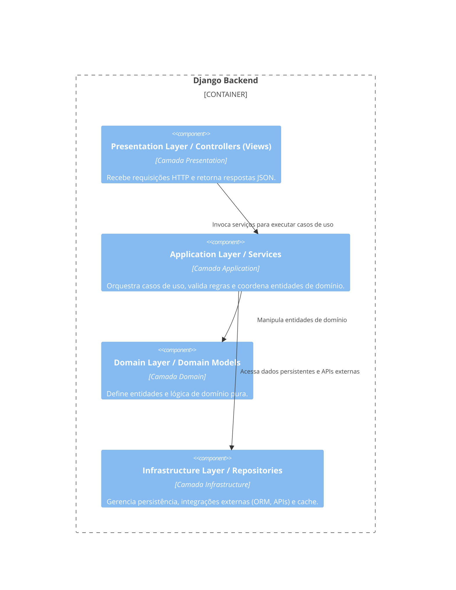

# Recicash - Backend Component Diagram

```mermaid
C4Component

    Container_Boundary(backend, "Django Backend") {
        Component(presentation, "Presentation Layer / Controllers (Views)", "Camada Presentation", "Recebe requisições HTTP e retorna respostas JSON.")
        Component(application, "Application Layer / Services", "Camada Application", "Orquestra casos de uso, valida regras e coordena entidades de domínio.")
        Component(domain, "Domain Layer / Domain Models", "Camada Domain", "Define entidades e lógica de domínio pura.")
        Component(infrastructure, "Infrastructure Layer / Repositories", "Camada Infrastructure", "Gerencia persistência, integrações externas (ORM, APIs) e cache.")
    }

    Rel(presentation, application, "Invoca serviços para executar casos de uso")
    Rel(application, domain, "Manipula entidades de domínio")
    Rel(application, infrastructure, "Acessa dados persistentes e APIs externas")
    
    UpdateRelStyle(presentation, application, $offsetX="-50", $offsetY="30")
    UpdateRelStyle(application, domain, $offsetX="50", $offsetY="5")
    UpdateRelStyle(application, infrastructure, $offsetX="10")
```
