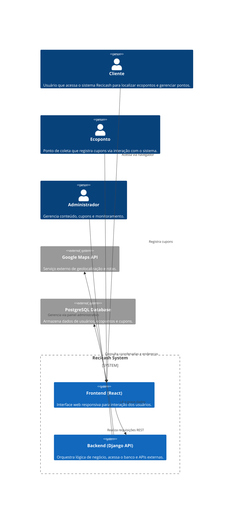

# Recicash – System Context Diagram

```mermaid
%%{init: {"theme":"base", "themeVariables":{"background":"#ffffff"}}}%%
C4Context
    Person(cliente, "Cliente", "Usuário que acessa o sistema Recicash para localizar ecopontos e gerenciar pontos.")
    Person(ecoponto, "Ecoponto", "Ponto de coleta que registra cupons via interação com o sistema.")
    Person(admin, "Administrador", "Gerencia conteúdo, cupons e monitoramento.")
    
    System_Boundary(RecicashBoundary, "Recicash System") {
        System(frontend, "Frontend (React)", "Interface web responsiva para interação dos usuários.")
        System(backend, "Backend (Django API)", "Orquestra lógica de negócio, acessa o banco e APIs externas.")
    }

    System_Ext(google, "Google Maps API", "Serviço externo de geolocalização e rotas.")
    System_Ext(postgres, "PostgreSQL Database", "Armazena dados de usuários, ecopontos e cupons.")

    Rel(cliente, frontend, "Acessa via navegador")
    Rel(admin, frontend, "Gerencia via painel administrativo")
    Rel(ecoponto, frontend, "Registra cupons")
    Rel(frontend, backend, "Realiza requisições REST")
    Rel(backend, postgres, "Lê e grava dados")
    Rel(backend, google, "Consulta coordenadas e endereços")
    
    UpdateLayoutConfig($c4ShapeInRow="2", $c4BoundaryInRow="1")
    UpdateRelStyle(cliente, frontend, $offsetX="30", $offsetY="-300")
    UpdateRelStyle(admin, frontend, $offsetX="-185", $offsetY="50")
    UpdateRelStyle(ecoponto, frontend, $offsetX="160", $offsetY="-100")
    UpdateRelStyle(frontend, backend, $offsetX="-50", $offsetY="30")
    UpdateRelStyle(backend, postgres, $offsetX="60", $offsetY="80")
    UpdateRelStyle(backend, google, $offsetX="25", $offsetY="0")
```
